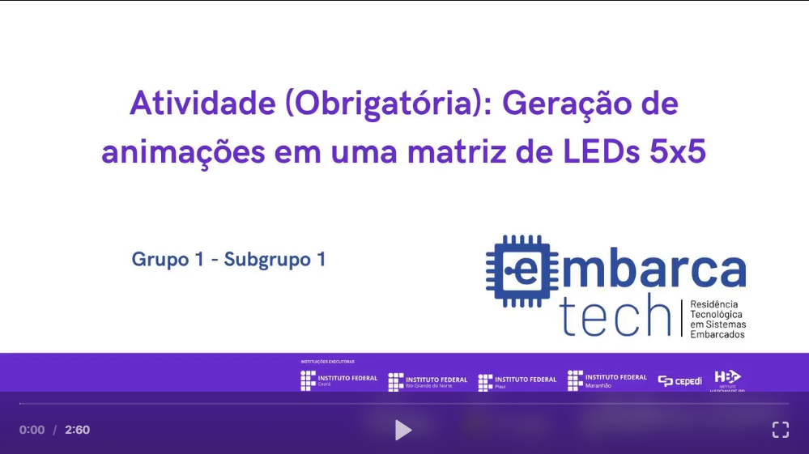

# EmbarcaTech_Unidade4_GPIO_PARTE2.

  

## Atividade (Obrigatória): Geração de animações em uma matriz de LEDs 5x5.

## Descrição do Projeto

Este projeto visa criar animações de curta duração em uma matriz de LEDs 5x5 (WS2812), utilizando um microcontrolador Raspberry Pi Pico W e um teclado matricial 4x4. O sistema permite executar diferentes animações de acordo com as teclas pressionadas, bem como acionar cores predefinidas e controlar a intensidade dos LEDs. Um buzzer também pode ser usado para gerar sinais sonoros. Todas as funcionalidades foram desenvolvidas no simulador de eletrônica Wokwi, integrado ao ambiente VS Code. Também foi reproduzido na plataforma educacional BitDogLab.

## Componentes Utilizados

- **Matriz de LEDs Coloridos (LED-RGB 5x5 WS2812)**: Para exibição das animações.
- **Buzzer**: Utilizado para emitir sinais sonoros.
- **Microcontrolador Raspberry Pi Pico W (RP2040)**: Responsável pelo controle dos pinos GPIO.
- **Teclado Matricial 4x4**: Para envio de comandos.

## Ambiente de Desenvolvimento

- **VS Code**: Ambiente de desenvolvimento utilizado para escrever e debugar o código.
- **Linguagem C**: Linguagem de programação utilizada no desenvolvimento do projeto.
- **Pico SDK**: Kit de Desenvolvimento de Software utilizado para programar a placa Raspberry Pi Pico W.
- **Simulador Wokwi**: Ferramenta de simulação utilizada para testar o projeto.

## Guia de Instalação

1. Clone o repositório:
2. Importe o projeto utilizando a extensão da Raspberry Pi.
3. Compile o código utilizando a extensão da Raspberry Pi.
4. Caso queira executar na placa BitDogLab, insira o UF2 na placa em modo bootsel (Um teclado matricial deve estar conectado).
5. Para a simulação, basta executar pela extensão no ambiente integrado do VSCode.

## Guia de Uso

Para cada comando, existe uma funcionalidade. Abaixo estão listadas cada uma delas:

| Botão   | Função                                       |
|---------|----------------------------------------------|
|    A    | Desliga todos os LEDs                        |
|    B    | LEDs na cor azul com 100% de intensidade     |
|    C    | LEDs na cor vermelha com 100% de intensidade |
|    D    | LEDs na cor verde com 100% de intensidade    |
|    #    | LEDs na cor branca com 100% de intensidade   |
|    0    | Animação de coração                          |
|    1    | Animação de rosto feliz                      |
|    2    | Animação de rosto triste                     |
|    3    | Animação de robô                             |
|    4    | Animação de quadrado aumentando e diminuindo |
|    5    | Animação de relógio                          |
|    6    | Animação do fantasma do Pac Man              |
|    7    | Animação de um cacto                         |
|    8    | Animação de chamas                           |
|    9    | Animação de espiral                          |
|    *    | Habilita o modo de gravação via software     |

## Testes

Testes básicos foram implementados para garantir que cada componente está funcionando corretamente. 

## Colaboradores

- **Líder do Projeto**: [Lucas Gabriel Ferreira](https://github.com/usuario-lider)
- **Desenvolvedores**:
    - [Ângelo Miguel](https://github.com/micheltechEr)
    - [Maria Luiza Brasil Medrado](https://github.com/MariaLuizaBM)
    - [Mateus Soares](https://github.com/mateussoaress)

## Vídeo da Solução

Clique na imagem abaixo para assistir ao vídeo que demonstra a solução trabalhada e os resultados obtidos nos experimentos:

  

